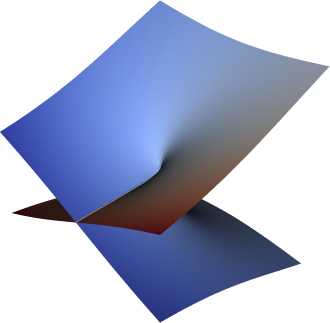
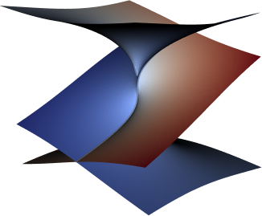

EasterEig
=========
[](https://www.gnu.org/licenses/gpl-3.0) [](https://github.com/nennigb/EasterEig/actions/workflows/ci-ubuntu.yml) [](https://pypi.org/project/eastereig/)

Consider a **parametric eigenvalue problem** depending on one scalar $\nu$ or given vector $\boldsymbol\nu =(\nu_1,\nu_2,\ldots,\nu_N) \in \mathbb{C}^N$ of paramaters. This arises for instance in

  - waveguides, where the _wavenumber_ (eigenvalue) depends on the frequency (parameter)
  - waveguides with absorbing materials on the wall, where _modal attenuation_ (eigenvalue imaginary part) depends on the liner properties like impedance, admittance, density (parameter)
  - structural dynamics with a randomly varying parameter, where the _resonances frequencies_ (eigenvalue) depend on for instance of material parameters like Young modulus or density
  - ...

The aim of this package is to **reconstruct** the eigenvalue loci and to **locate** exceptional points (EPs). The EPs in non-Hermitian systems correspond to particular values of the parameters leading to defective eigenvalue. At EPs, both eigenvalues and eigenvectors are merging.

  

The theoretical parts of this work are described in [1] for the location of _exceptional points_ and in [2] for eigenvalues reconstruction. The extension to several parameters is presented in [3].

The method requires the computation of successive derivatives of some selected eigenvalues with respect to the parameter so that, after recombination, regular functions can be constructed. This algebraic manipulation overcomes the convergence limits of conventional methods due to the singularity branch point. This enables
 * Fast approximation of eigenvalues, converging over a large region of parametric space
 * High order EP localization
 * Computation of the associated Puiseux series up to an arbitrary order
 * Numerical representation of the problem discrimiant and of the partial characteristic polynomial
  
To use this package :

  1. An access to the **operator derivative** with respect to $\boldsymbol\nu$ is required
  2. The parametric eigenvalue problem must have the form
$$\mathbf{L} (\lambda(\boldsymbol\nu), \boldsymbol\nu) \mathbf{x} (\boldsymbol\nu) =\mathbf{0},$$
where, for a given vector $\boldsymbol\nu$ which contains $N$ independent complex-valued parameters, $\lambda(\boldsymbol\nu)$ is an eigenvalue and $\mathbf{x}(\boldsymbol\nu)\neq \mathbf{0}$ is the associated right eigenvector. Here the matrix $\mathbf{L}$ admits the decomposition
$$\mathbf{L} (\lambda, \boldsymbol\nu)  =\sum_{i \geq 0} f_i(\lambda) \mathbf{K}_i(\boldsymbol\nu)$$
where $f_i$ is a polynomial function and matrices $\mathbf{K}_i$
are supposed to be an analytic function of the parameters vector $\boldsymbol\nu$.

The matrices of discrete operators can be either of numpy type for _full_, scipy type for _sparse_ or petsc mpiaij type for _sparse parallel_ matrices.

If eastereig is useful for your research, please cite the following references. If you have some questions, suggestions or find some bugs, report them as issues [here](https://github.com/nennigb/EasterEig/issues).

References
----------

   [1] B. Nennig and E. Perrey-Debain. A high order continuation method to locate exceptional points and to compute Puiseux series with applications to acoustic waveguides. J. Comp. Phys., 109425, (2020). [[doi](https://dx.doi.org/10.1016/j.jcp.2020.109425)]; [[open access](https://arxiv.org/abs/1909.11579)]

   [2] M. Ghienne and B. Nennig. Beyond the limitations of perturbation methods for real random eigenvalue problems using Exceptional Points and analytic continuation. Journal of Sound and vibration, (2020). [[doi](https://doi.org/10.1016/j.jsv.2020.115398)]; [[open access](https://hal.archives-ouvertes.fr/hal-02536849)]
   
   [3] B. Nennig, Martin Ghienne, E. Perrey-Debain. Fast recovery of parametric eigenvalues depending on several parameters and location of high order exceptional points. arXiv 2505.06141, (2025). [[open access](https://arxiv.org/abs/2505.06141)]
       
Install 
--------

`eastereig` is based on numpy (full) and scipy (sparse) for most internal computation and can handle _large_ parallel sparse matrices thanks to **optional** import of [petsc4py (>=3.20)](https://petsc.org/release/petsc4py/install.html) (and mumps), 
[slepc4py](https://slepc4py.readthedocs.io/en/stable/install.html) 
and [mpi4py](https://mpi4py.readthedocs.io/en/stable/install.html). As non-Hermitian problems involve complex-valued eigenvalues, computations are realized with complex arithmetic and the **complex petsc version** is expected.
The [sympy](https://docs.sympy.org) package is used for formal manipulation of multivariate polynomials.
Riemann surface can also be plotted using the `Loci` class either with `matplotlib` or with [`pyvista`](https://github.com/pyvista/pyvista) and [`pyvistaqt`](https://github.com/pyvista/pyvistaqt) (optional).

Before installing `eastereig`, you'll need python (tested for v >= 3.8), `pip`, and to manually install the **optional** dependencies you want:
* The python packages `pyvista` and `pyvistaqt` (optional Riemann surfaces plotting)
* The python package `petsc4py` and `slepc4py` (optional sparse parallel matrices surpport)
* A fortran compiler (only for building from the sources, tested with `gfortran` on linux and macos, with `m2w64-toolchain` on windows with conda or with `rtools` distribution of `mingw64`)
* The python package `scikit-umfpack` to improve `scipy.sparse` LU factorization performance.

**Other dependencies will be installed automatically**.

### From the wheel
The easiest way to install `eastereig` is to use the wheel available on pypi. Wheels, with compiled extension, are available for the most usual 64 bits architectures and os (Linux, Windows, Macos). You can install `eastereig` from pip:
```console
pip install eastereig [--user]
```
If wheels are not available, the pure python version will be installed. You can also use a virtual environnement for better isolation.

### From the source
If you need to modify the code or the last development version, you need to build `eastereig` from the source. The sources are available on pypi or on the github [repos](https://github.com/nennigb/EasterEig/).

If the variable `use_fpoly=false`, the fortran extension is skipped. If `use_fpoly=true`, the fortran extension is enabled. The evaluations of the PCP will be faster but a fortran compiler is required.

Once you manualy get the sources, in the `eastereig` source folder (same folder as `meson.build` file), run
```console
pip install -v . -Csetup-args=-Duse_fpoly=true
```
or,
```console
pip install -v --no-build-isolation --editable . -Csetup-args=-Duse_fpoly=true
```
to install it in editable mode. If `-Csetup-args=-Duse_fpoly=true` is omitted, the default behavior, defined is `meson.options` applied.

If needed, please see the steps given in the continuous integration scripts [ci-ubuntu](.github/workflows/ci-ubuntu.yml).


Running tests
-------------
Tests are handled with `doctest` and with `unittest`.  To execute the full test suite, run :
```console
python -m eastereig
```


Basic workflow and class hierarchy
----------------------------------
`eastereig` provides several top level classes:

  1. **OP class**, defines operators of your problem
  2. **Eig class**, handles eigenvalues, their derivatives and reconstruction
  3. **CharPol class**, combines several eigenvalues and their derivatives to reconstruction a part of the characteristic polynomial
  4. **EP class**, combines Eig object to locate EP and compute Puiseux series
  5. **Loci class**, stores numerical value of eigenvalues loci and allows easy Riemann surface plotting


Getting started
---------------
Several working examples are available in `./examples/` folder
  
  1. Acoustic waveguide with an impedance boundary condition (with the different supported linear libraries)
  2. 3-dof toy model of a structure with one random parameter (with numpy)
  3. 3-dof toy with two parameters, based on `CharPol` class and leading to EP3
  4. ...

> **Remarks :**
> To run an example with petsc (parallel), you need to run python with `mpirun` (or `mpiexec`). For instance, to run a program with 2 proc
> `mpirun -n 2 python myprog.py`

To get started, the first step is to define your problem. Basically it means to link the discrete operators (matrices) and their derivatives to the `eastereig` OP class.
The problem has to be recast in the following form:

```math
\left[\underbrace{1}_{f_0(\lambda)=1} \mathbf{K}_0(\nu) + \underbrace{\lambda(\nu)}_{f_1(\lambda)=\lambda} \mathbf{K}_1(\nu) + \underbrace{\lambda(\nu)^2}_{f_2(\lambda)=\lambda^2} \mathbf{K}_2(\nu) \right] \mathbf{x} =  \mathbf{0}.
```

Matrices are then stacked in the variable `K`
```python
K = [K0, K1, K2].
```
**The functions** that return the derivatives with respect to $$\nu$$ of each matrices have to be put in `dK`. The prototype of this function is fixed (the parameter n corresponds to the derivative order) to ensure automatic computation of the operator derivatives.
```python
dK = [dK0, dK1, dK2].
```
Finally, **the functions** that returns derivatives with respect to $\lambda$ are stored in $f_i(\lambda)$
```python
flda = [None, ee.lda_func.Lda, ee.lda_func.Lda2].
```
Basic linear and quadratic dependency are defined in the module `lda_func`. Others dependencies can be easily implemented; provided that the appropriate eigenvalue solver is also implemented). The `None` keyword is used when there is no dependency to the eigenvalue, e. g. $\mathbf{K}_0$.

This formulation is used to automatically compute (i) the successive derivatives of the operator and (ii) the RHS associated to the bordered matrix.

These variables are defined by creating **a subclass** that inherits from the eastereig **OP class** (`OPmv` for the multivariate case). For example, considering a generalized eigenvalue problem $$\left[\mathbf{K}_0(\nu) + \lambda \mathbf{K}_1(\nu) \right] \mathbf{x} =  \mathbf{0} $$:

```python
import eastereig as ee

class MyOP(ee.OP):
    """Create a subclass of the OP class to describe your problem with scalar parameter."""

    def __init__(self, z, ...):
        """Initialize the problem."""
        # Initialize OP interface
        self.setnu0(z)
        
        # Mandatory -----------------------------------------------------------
        self._lib='scipysp' # 'numpy' or 'petsc'
        # Create the operator matrices
        self.K = self.CreateMyMatrix()
        # Define the list of function to compute the derivatives of each operator matrix (assume 2 here)
        self.dK = [self.dmat0, self.dmat1]        
        # Define the list of functions to set the eigenvalue dependency of each operator matrix
        self.flda = [None, ee.lda_func.Lda] 
        # ---------------------------------------------------------------------

    def CreateMyMatrices(self, ...):
        """Create my matrices and return a list."""
 		...
    	return list_of_Ki
    
    def dmat0(self, n):
        """Return the matrix derivative with respect to nu.

		N.B. : The prototype of this function is fixed, the n parameter
		stands for the derivative order. If the derivative is null,
		the function returns the value 0.
		"""
		...
		return dM0
    
    def dmat1(self, n):
        """Return the matrix derivative with respect to nu.

		N.B. : The prototype of this function is fixed, the n parameter
		stands for the derivative order. If the derivative is null,
		the function returns the value 0.
		"""
		...
		return dM1
```

Documentation
--------------

## Generate documentation 
Run: 
```console
pdoc3 --html --force --config latex_math=True  eastereig [--skip-errors]
```
N.B: The doctring are compatible with several Auto-generate API documentation, like pdoc.
This notably allows to see latex includes.

## Generate class diagram
Run: 
```console
pyreverse -s0 eastereig -m yes -f ALL
dot -Tsvg classes.dot -o classes.svg
```
N.B: Class diagram generation is done using `pyreverse` (installed with pylint and spyder).

## Generate documentation and class diagram
Both aspects are included in the `makedoc.py' script. So, just run :
```console
python ./makedoc.py
```

How to contribute ?
-------------------

If you want to contribute to `eastereig`, your are welcomed! Don't hesitate to
  - report bugs, installation problems or ask questions on [issues](https://github.com/nennigb/EasterEig/issues);
  - propose some enhancements in the code or in documentation through **pull requests** (PR);
  - suggest or report some possible new usages and why not start a scientific collaboration ;-)
  - ...
  
To ensure code homogeneity among contributors, we use a source-code analyzer (eg. pylint). 
Before submitting a PR, run the tests suite.


License
-------
This file is part of eastereig, a library to locate exceptional points and to reconstruct eigenvalues loci.

Eastereig is free software: you can redistribute it and/or modify it under the terms of the GNU General Public License as published by the Free Software Foundation, either version 3 of the License, or (at your option) any later version.

Eastereig is distributed in the hope that it will be useful, but WITHOUT ANY WARRANTY; without even the implied warranty of MERCHANTABILITY or FITNESS FOR A PARTICULAR PURPOSE.  See the GNU General Public License for more details.

You should have received a copy of the GNU General Public License along with Eastereig.  If not, see <https://www.gnu.org/licenses/>.
